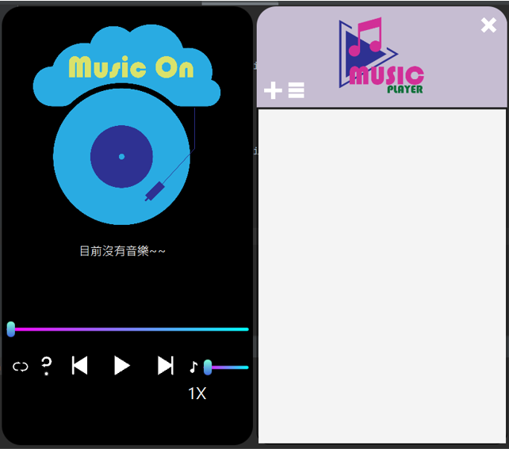

# MP3 based on JAVA

## 工作分配

|**工作內容**|**負責人員**|
|:------------:|:------------:|
|播放鍵、隨機播放、循環播放、上下首鍵、增加曲目功能|范家齊|
|刪除音樂、生成音樂列表、點及音樂列表切換歌取功能|尤重鈞|
|音量調整、播放速度調整功能|李家祐|
|時間軸功能、版面設計、整合和微調、簡報製作|黃曦樂|

## 播放介面

## 待完成功能

1. 歌曲內容資料庫
2. 網路連線功能
3. 自動化圖像